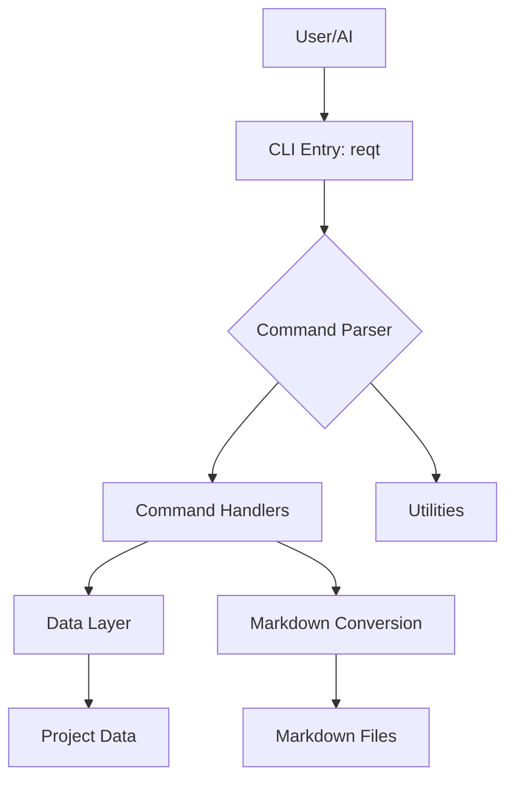
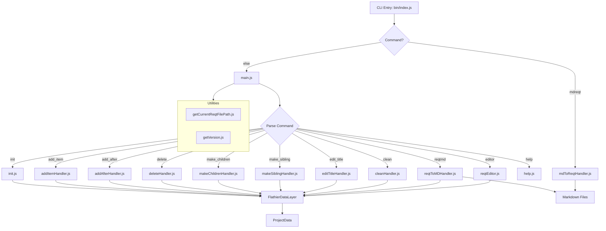
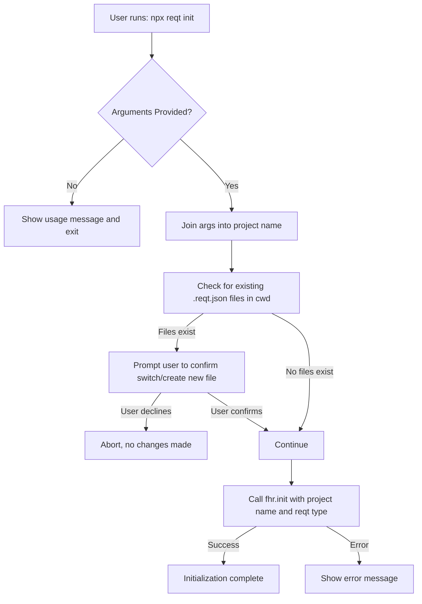

# ReqText CLI Architecture

Design Reqs:

ALWAYS USE ES MODULES, never require.

## High Level 

Needs to be human readable and easy to understand.

## High Level (Simple)

## Testing Design

Only use node.js for testing. No external libraries. This makes it easier to run tests in any environment especially since the AI can quickly evaluate printed statements with sophicasted testing reports.

## Test Fields Handling

As of flathier version 0.1.0-demo.9 and later, the fields `test_exists` and `test_passed` are automatically included in all new and template items by the flathier library. There is no need for ReqText to add or manage these fields manually in its own logic.

## Init Change Request
