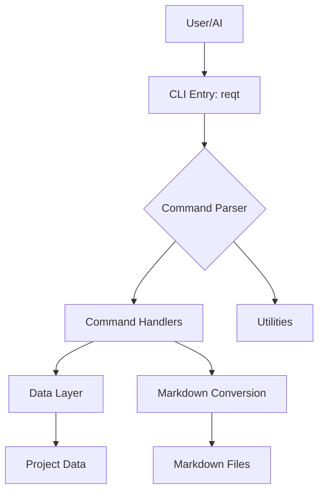
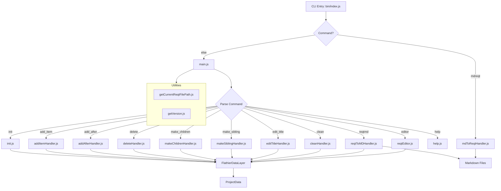

# ReqText CLI Architecture

## High Level 

Needs to be human readable and easy to understand.

## High Level (Simple)

## Testing Design

Only use node.js for testing. No external libraries. This makes it easier to run tests in any environment especially since the AI can quickly evaluate printed statements with sophicasted testing reports.

