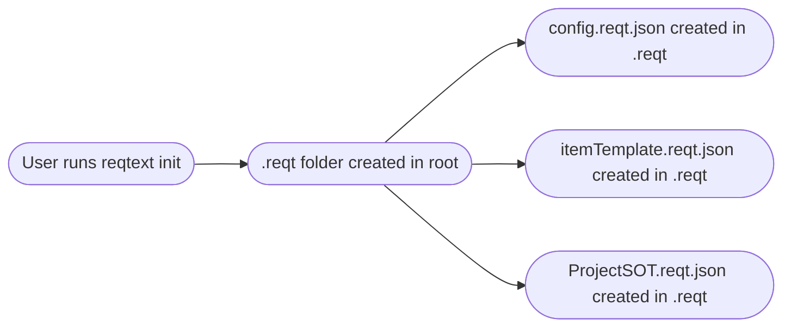

# ReqText Flowcharts

- Source of Truth (SoT) is the main data source.
    - .reqt.json files
- Read Write Handler (readWriteHandler.js) is responsible for reading and writing data to the SoT. Nothing else has access. 
- The diff gate checks if when the user change something through the CLI, that there are no difference in the markdown editable fields between the SoT and the current markdown file
    - If there is a difference, do not make the change and notify the user
    - If there are no difference make the change and notify succesful

## ReqText Data Flow

````mermaid
flowchart TD
    Start([Start: CLI Request])
    Markdown([📄 Markdown File])
    Diff{Diff Gate fn}
    RWH[Read Write Handler]
    SoT[Source of Truth]
    mem[App Memory]
    Notify[Notify User]

    Start --> Diff
    Markdown --> Diff
    Diff -- "No Differences" --> RWH
    Diff -- "Differences" --> Notify
    RWH --> SoT
    RWH --> mem
````

# ReqText Init Design

Change from using flathier init to reqtext's own init for creating the templates and sot. 

- User calls `init` from the project root.
- Create the `.reqt` folder in the root directory (wherever `init` is called).
    - This ensures all reqtext files are organized and project-local.
- Create `config.reqt.json` in `.reqt`.
    - Stores configuration, including the path to the project SoT file (which must be in `.reqt`).
- Create `itemTemplate.reqt.json` in `.reqt`.
    - Used as a template for creating new items in the project.
- Create `ProjectSOT.reqt.json` in `.reqt`.
    - This is the Source of Truth (SoT) for the project and must always reside in `.reqt`.




